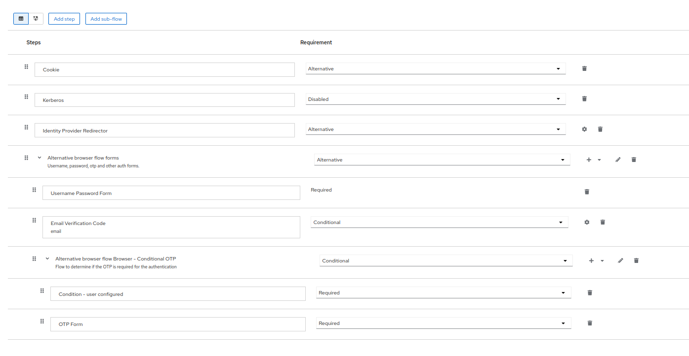

# Keycloak Email 2FA SPI

[](https://github.com/mt-ag/keycloak-2fa-email/actions/workflows/maven.yml)

Keycloak SPI that adds an individual authenticator for two-factor authentication via email.

## Getting started

Build the project locally:

```shell
git clone https://github.com/mt-ag/keycloak-2fa-email
cd keycloak-2fa-email
mvn package
```

Copy the generated `.jar` file from the `target/` directory, into the `keycloak/providers/` directory.

## Setup

### SMTP Server

Connect Keycloak to an SMTP server in your realm's email settings.
See the [official Keycloak documentation](https://www.keycloak.org/docs/latest/server_admin/index.html#_email) for more
details on how to do so.

### Authentication Flows

The SPI adds aa new authentication provider that can be used in browser-based Auth-flows.
First make a copy of the built-in browser flow.
Add the step `Email Verification Code` to the flow and set it to be conditional.
See:



There are three settings for the `Email Verification Code` step:

| Name         | Description                                     | Default            |
|--------------|-------------------------------------------------|--------------------|
| Code length  | Length of the generated code                    | `6`                |
| Code Base    | Used characters in the generated code           | `1234567890ABCDEF` |
| Time-to-live | Time to live of the code to be valid in seconds | `300`              |

### User requirements

A user hat to meet the following requirements to use the email 2FA provider:

- User needs an email address in their profile
- The email address must be verified

The `Email Verification Code` can be added to a conditional flow, so that is only used for specific users.

## Contributing

We are happy to receive pull request and issues.

### Development

First clone the repository and build the project:

```shell
git clone https://github.com/mt-ag/keycloak-2fa-email
cd keycloak-2fa-email
mvn package
```

To test the SPI, you can use the `docker-compose.yml` file in the root directory of the repository.
It starts a Keycloak instance with the SPI and a MailHog instance to capture all emails sent by Keycloak.

```shell
docker-compose up
```

After the first start you have to configure Keycloak to use `localhost:1025` as host and port for the SMTP server.
Then navigate your browser to `http://localhost:8025` to see all emails that have been sent by Keycloak.
To access the Keycloak admin console, use `http://localhost:8080` and log in with the credentials `admin` and `admin`.
